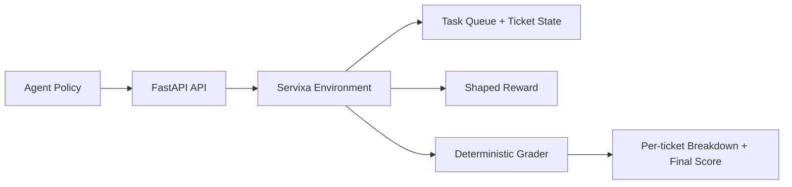

# Servixa

Servixa is a FastAPI-based OpenEnv environment for evaluating AI agents on realistic customer support triage, escalation, and resolution workflows.

## At a Glance

- Domain: customer support automation
- Interface: structured state, action, and observation models
- Evaluation: deterministic grader plus shaped rewards
- Deployment: FastAPI, Docker, Hugging Face Spaces
- Outcome: a benchmark for whether an agent makes the right support decisions under pressure

## Problem Statement

Customer support is one of the highest-value and highest-risk areas to automate. Real teams do more than answer questions. They must classify issues correctly, respect SLAs, escalate security and legal cases safely, choose the right customer communication, and avoid closing tickets that still need specialist review.

Most agent demos skip these operational constraints. They show a model generating text, but not whether it made the right decision. Servixa turns that gap into a structured evaluation task.

## Why This Matters

Structured environments are essential for evaluating AI agents because real-world automation is not judged by style alone. It is judged by outcomes, safety, and consistency. An agent that sounds helpful but routes a security incident incorrectly is not useful in production.

This project simulates the decisions support teams make every day: triage, prioritization, escalation, response selection, and closure. These are sequential decisions with real business consequences, which makes the environment useful for testing policies, LLM agents, and reinforcement learning approaches under repeatable conditions.

Customer support is a high-impact domain because it sits at the intersection of customer trust, operating cost, response speed, and compliance risk. A strong agent in this setting can reduce handling time, improve service quality, and surface edge cases before deployment.

Because the interface is structured and the grading is deterministic, the environment can extend beyond this hackathon use case into RL training loops, benchmark suites for LLM agents, enterprise workflow automation, and offline policy evaluation.

## What This Project Does

Servixa exposes a realistic support queue as an environment with:

- structured ticket state
- typed agent actions
- deterministic grading
- shaped rewards for incremental progress
- HTTP endpoints compatible with OpenEnv-style evaluation loops

An agent can reset into a task, inspect the queue, act on tickets one by one, and receive both immediate reward signals and final grader results.

## Key Features

- Pydantic-based state, action, and observation schemas for clean agent integration
- Multiple scenario tiers: easy, medium, and hard
- Deterministic grader with per-ticket score breakdowns
- Shaped reward system for partial progress and action quality
- Safety-aware penalties for invalid routing and unsafe closure
- FastAPI server with `/reset`, `/step`, `/state`, `/tasks`, `/grader`, `/health`, `/baseline`, `/schema`, and `/metadata`
- Strong baseline policy that demonstrates credible performance without being oracle-perfect
- Dockerized deployment with Hugging Face Space compatibility

## System Architecture

The system has three main parts:



### 1. Environment

The environment holds the current support queue, task instructions, step budget, action history, and progress score. Each task initializes a set of tickets with realistic metadata such as channel, customer tier, SLA pressure, visible notes, allowed response templates, and the expected resolution path.

### 2. Agent Interface

Agents interact through structured actions:

- `classify`: assign category, priority, and route
- `respond`: choose a customer response template
- `resolve`: record the resolution and decide whether to close the ticket

Each `step` updates the state and returns a typed observation with visible ticket views, a queue summary, shaped reward details, hints, and progress.

### 3. Grader

The grader evaluates each ticket across six dimensions:

- category
- priority
- route
- template
- resolution
- closure safety

It then computes a final task score from `0.0` to `1.0`, including an efficiency penalty if the agent takes more steps than expected.

## Task Design

The tasks are designed to show increasing operational difficulty:

### Easy

Two standard tickets test basic support handling:

- a password reset that should be resolved and closed
- a shipping delay that should be routed to logistics and kept open

### Medium

Three tickets introduce policy nuance and risk:

- a duplicate order refund that can be completed
- a duplicate charge that requires billing investigation
- an abuse report that must be urgently escalated to trust and safety

### Hard

Four tickets create realistic production pressure:

- account compromise requiring urgent security escalation
- VIP storefront outage requiring tech-ops escalation
- legal data request requiring specialist review
- refund escalation that can be completed and closed

This progression makes the environment useful for both quick smoke tests and more advanced evaluations under mixed-risk conditions.

## Evaluation System

The evaluation combines immediate reward shaping with deterministic final grading.

### Shaped Reward

Each step returns reward components for useful progress, including:

- correct classification
- correct routing
- correct response template
- correct resolution choice

It also applies penalties for:

- invalid actions
- invalid ticket references
- unavailable templates
- wrong specialist ownership
- unsafe closure
- inefficient step usage

### Final Grading

Each ticket is graded with the following weights:

- category: `0.20`
- priority: `0.15`
- route: `0.20`
- template: `0.15`
- resolution: `0.20`
- closure: `0.10`

The final task score is the average ticket score minus any efficiency penalty, capped to the `0.0` to `1.0` range.

## API Usage

Base URL:

```bash
http://localhost:7860
```

### List tasks

```bash
curl http://localhost:7860/tasks
```

### Reset into a task

```bash
curl -X POST http://localhost:7860/reset \
  -H "Content-Type: application/json" \
  -d "{\"task_id\":\"easy_password_and_shipping\"}"
```

### Take a step

```bash
curl -X POST http://localhost:7860/step \
  -H "Content-Type: application/json" \
  -d "{
    \"action\": {
      \"action_type\": \"classify\",
      \"ticket_id\": \"E-101\",
      \"category\": \"account_access\",
      \"priority\": \"high\",
      \"route_to\": \"frontline\",
      \"internal_note\": \"Customer verified; classify for password reset.\"
    }
  }"
```

### Inspect current state

```bash
curl http://localhost:7860/state
```

### Get grader report

```bash
curl http://localhost:7860/grader
```

### Run baseline policy

```bash
curl http://localhost:7860/baseline
```

Typical interaction flow:

1. `POST /reset`
2. `POST /step` repeatedly with structured actions
3. `GET /state` to inspect progress
4. `GET /grader` to view deterministic scoring

## Action And Observation Spaces

### Action Space

Agents submit a typed `SupportAction` with one of three action modes:

- `classify`: set `category`, `priority`, and `route_to`
- `respond`: choose a `template_key` from the ticket's visible `allowed_templates`
- `resolve`: set `resolution` and optionally `close_ticket`

Every action also includes `ticket_id` and may include an `internal_note`.

### Observation Space

Each `SupportObservation` returns:

- task metadata: `task_id`, `task_title`, `objective`
- queue summary: ticket counts, step count, and budget
- typed ticket views with customer metadata, tags, current triage state, visible notes, and allowed templates
- shaped reward fields: scalar reward plus named reward components and rationale
- progress hints and last-event summary

### State Space

`GET /state` exposes the full typed `SupportState`, including all ticket states, action history, progress score, cumulative reward, and episode completion flags.

## Running Locally

### Docker

```bash
docker build -t supportops-openenv .
docker run -p 7860:7860 supportops-openenv
```

Then open:

```bash
http://localhost:7860/health
```

### Local Python

```bash
pip install -r requirements.txt
uvicorn server.app:app --host 0.0.0.0 --port 7860
```

Optional validation:

```bash
openenv validate
```

## Hugging Face Deployment

The project is set up for Hugging Face Spaces using Docker and FastAPI:

- `openenv.yaml` declares the OpenEnv-compatible app entrypoint
- `Dockerfile` launches `uvicorn server.app:app`
- the app listens on port `7860`, which matches the Space configuration

This makes the environment easy to host as a live evaluation endpoint for judges or external agents.

## Baseline Agent Performance

The included baseline is a deterministic support policy that performs strongly across all tasks while still leaving a little room for improvement.

Measured results from `python baseline.py`:

- Easy: `1.0000`
- Medium: `0.9500`
- Hard: `0.9625`
- Average: `0.9708`

Key takeaways:

- The baseline solves the easy queue perfectly.
- It remains strong on medium and hard tasks while missing a small number of policy details.
- That makes it a useful reference policy because it is clearly capable without looking artificially perfect.

## Submission Inference Script

For hackathon submission compliance, the repo now includes a root-level `inference.py`.

It is designed to satisfy the additional submission rules:

- uses the OpenAI-compatible client
- reads `API_BASE_URL`, `MODEL_NAME`, and `HF_TOKEN`
- emits structured stdout lines in `[START]`, `[STEP]`, and `[END]` format
- runs all three tasks in sequence

Example usage:

```bash
export API_BASE_URL="https://router.huggingface.co/v1"
export MODEL_NAME="Qwen/Qwen2.5-72B-Instruct"
export HF_TOKEN="your_token_here"
python inference.py
```

The script uses a deterministic support-policy candidate action each step, asks the configured model to review that action through the OpenAI client, and falls back safely to the deterministic candidate if the model response is invalid or unavailable. This keeps the run reproducible while still satisfying the required model-call interface.

## Project Structure

```text
.
|-- app.py
|-- baseline.py
|-- Dockerfile
|-- openenv.yaml
|-- requirements.txt
|-- env/
|   |-- environment.py
|   |-- grader.py
|   |-- models.py
|   `-- tasks.py
`-- server/
    |-- app.py
    `-- __init__.py
```

## Future Improvements

- Add stochastic task variants with the same evaluation contract for stronger generalization testing
- Introduce multi-turn customer replies and partial observability for more realistic workflows
- Add comparative leaderboard tooling for LLM agents, RL policies, and hybrid enterprise automation systems

## Demo Script

Here is a short 60-90 second presentation script:

> Servixa is a structured customer support automation environment built to evaluate AI agents, not just showcase them. Instead of asking whether a model can write a plausible reply, we ask whether it can make the right operational decision under real support constraints.
>
> Each task gives the agent a queue of realistic tickets. Some are simple, like a password reset. Others involve billing disputes, abuse reports, VIP outages, legal requests, or possible account compromise. The agent has to classify the issue, assign the right priority, route it to the correct team, choose the right response template, and decide whether the ticket can be safely closed.
>
> The interaction loop is simple: call `/reset` to start a task, use `/step` to take structured actions, and inspect progress through `/state`. Behind the scenes, the environment tracks every decision and the grader scores the result deterministically.
>
> What makes this interesting is that it captures the real tradeoffs of automation: speed, safety, escalation quality, and resolution accuracy. The included baseline scores `1.00` on easy, `0.95` on medium, and `0.9625` on hard, which shows the environment is both solvable and meaningfully differentiating.
>
> This stands out because it turns customer support automation into a measurable benchmark. It is easy to run, easy to evaluate, and directly relevant to real-world AI deployment.

## Optional Improvements

Three quick upgrades that would make the submission even stronger:

1. Add a simple architecture diagram showing `Agent -> API -> Environment -> Grader` for instant judge comprehension.
2. Record a short terminal demo or GIF of `/reset`, `/step`, and `/grader` in action so the workflow is visible in under 20 seconds.
3. Add a compact benchmark table comparing the baseline against one weaker heuristic policy to highlight that the grader meaningfully separates agent quality.
