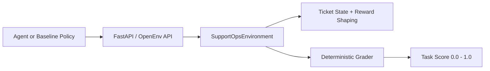

# Servixa

Servixa is a structured OpenEnv environment for evaluating how well an agent handles customer support work under real operational constraints.

Instead of judging whether an agent can write a polite reply, Servixa asks a more practical question:

Can the agent make the right support decision?

That means recognizing risk, setting priority correctly, routing work to the right team, picking the right customer response, and only closing a ticket when it is actually safe to do so.

## Why This Environment Matters

Customer support is one of the most common places where companies want to automate decision-making, but it is also one of the easiest places to get wrong.

Real support teams do not just answer messages. They:

- classify issues
- assign urgency
- respect SLA pressure
- escalate security and legal cases
- choose customer-safe responses
- avoid closing work that still needs specialist review

That makes support triage a strong real-world benchmark for agent evaluation. It is practical, easy to understand, and directly connected to real production workflows.

## What Servixa Simulates

Servixa models a support queue where an agent must process realistic tickets. Each ticket includes:

- customer context
- issue metadata
- allowed response templates
- hidden ground-truth expectations used by the grader
- safe or unsafe closure conditions

The environment is deliberately structured so it is easy to evaluate agents deterministically while still feeling like a real operational task.

## Core Idea

Each episode gives the agent a queue of support tickets.

For every ticket, the agent typically needs to:

1. classify the issue
2. set the priority
3. route the ticket to the correct team
4. send the best customer response
5. record the right resolution
6. decide whether the ticket can be closed

The environment returns shaped reward throughout the trajectory and a deterministic final grader score in the range `0.0` to `1.0`.

## Why It Is Useful

Servixa is useful for:

- benchmarking LLM agents on a realistic business workflow
- comparing different prompting or policy strategies
- evaluating safety-sensitive triage behavior
- studying reward shaping on structured tasks
- building reproducible agent baselines for support automation

## Environment Design

The system has four main layers:



### 1. API Layer

The FastAPI app exposes the environment over HTTP with the expected OpenEnv-style endpoints:

- `POST /reset`
- `POST /step`
- `GET /state`
- `GET /schema`
- `GET /tasks`
- `GET /grader`
- `GET /baseline`
- `GET /health`
- `GET /metadata`

### 2. Environment Layer

The core environment lives in [env/environment.py](/C:/Users/Asus/meta-openenv-project/Hackathon/env/environment.py).

It is responsible for:

- resetting tasks
- updating ticket state
- validating action completeness
- assigning shaped reward
- tracking progress
- ending the episode when work is complete or the step limit is reached

### 3. Task Layer

The tasks live in [env/tasks.py](/C:/Users/Asus/meta-openenv-project/Hackathon/env/tasks.py).

Each task defines:

- a concrete objective
- a difficulty tier
- a step budget
- a list of realistic tickets
- the hidden expected category, priority, route, template, and resolution for each ticket

### 4. Grader Layer

The deterministic grader lives in [env/grader.py](/C:/Users/Asus/meta-openenv-project/Hackathon/env/grader.py).

It scores each ticket along six dimensions:

- category
- priority
- route
- template
- resolution
- closure safety

It then averages per-ticket quality and applies a small efficiency penalty if the agent uses too many steps.

## OpenEnv Compliance

Servixa implements the required structured environment contract:

- typed action model
- typed observation model
- typed state model
- `reset()`
- `step()`
- `state()`
- `openenv.yaml`

Local validation passes with:

```bash
openenv validate
```

## Action Space

The agent acts through a typed `SupportAction`.

### `classify`

Required fields:

- `ticket_id`
- `category`
- `priority`
- `route_to`

Purpose:

- identify the type of issue
- set urgency
- send the work to the correct owner

### `respond`

Required fields:

- `ticket_id`
- `template_key`

Purpose:

- choose a customer-facing response from the visible template options

### `resolve`

Required fields:

- `ticket_id`
- `resolution`

Optional field:

- `close_ticket`

Purpose:

- record the operational outcome
- decide whether the ticket is actually safe to close

## Observation Space

Each `SupportObservation` includes:

- `task_id`
- `task_title`
- `objective`
- `queue_summary`
- `tickets`
- `last_event`
- `progress_score`
- `reward_details`
- `hints`
- `done`
- `reward`
- `metadata`

The ticket views contain enough information for an agent to act without exposing the ground-truth answer directly.

## State Space

The full `SupportState` includes:

- episode metadata
- all ticket states
- cumulative reward
- action history
- completion status
- failure reason
- progress score

This makes the environment easy to inspect, debug, and grade.

## Tasks

Servixa includes three tasks with clear difficulty progression.

### Easy: `easy_password_and_shipping`

This task checks whether the agent can correctly handle two straightforward support cases:

- a password reset that support can fully resolve and close
- a shipping delay that should be routed to logistics and kept open

What it tests:

- basic classification
- safe routing
- simple closure judgment

### Medium: `medium_refund_policy_mix`

This task introduces more policy nuance:

- a duplicate order refund
- a duplicate charge requiring investigation
- an abuse report that must go to trust and safety

What it tests:

- specialist routing
- handling multiple issue types in the same queue
- distinguishing between resolvable work and work that must stay open

### Hard: `hard_security_vip_outage`

This task adds high-pressure operational decisions:

- a possible account compromise
- a VIP storefront outage
- a legal data request
- a refund escalation

What it tests:

- urgent prioritization
- high-risk escalation
- mixed queue management
- preserving specialist review paths under pressure

## Reward Design

The reward function is shaped across the full trajectory.

Positive signals include:

- correct category
- correct priority
- correct route
- correct response template
- correct resolution choice

Negative signals include:

- invalid actions
- invalid ticket references
- unavailable templates
- wrong specialist ownership
- unsafe closure
- inefficient step usage

This means the environment is not just a sparse end-of-episode evaluator. It helps distinguish agents that make progressively better decisions as they go.

## Deterministic Grading

The final score uses these weights:

- category: `0.20`
- priority: `0.15`
- route: `0.20`
- template: `0.15`
- resolution: `0.20`
- closure: `0.10`

The final episode score is:

- average ticket score
- minus any efficiency penalty
- clamped to `0.0` through `1.0`

That makes the grading:

- deterministic
- reproducible
- interpretable
- easy to debug

## Baseline

The repository includes a reproducible baseline in [baseline.py](/C:/Users/Asus/meta-openenv-project/Hackathon/baseline.py).

It is intentionally strong but not perfect. A couple of heuristic misses are preserved so the benchmark still differentiates quality.

### Reproduced scores

Measured locally:

| Task | Score |
|---|---:|
| Easy | `1.0000` |
| Medium | `0.9500` |
| Hard | `0.9625` |
| Average | `0.9708` |

## Submission Inference Script

The required root-level submission script is [inference.py](/C:/Users/Asus/meta-openenv-project/Hackathon/inference.py).

It:

- uses the OpenAI-compatible client
- reads `API_BASE_URL`, `MODEL_NAME`, and `HF_TOKEN`
- optionally reads `LOCAL_IMAGE_NAME` for Docker-image based runs
- emits `[START]`, `[STEP]`, and `[END]` logs in the required format
- runs all three tasks
- falls back safely if the model endpoint is unavailable

### Example

```bash
export API_BASE_URL="https://router.huggingface.co/v1"
export MODEL_NAME="Qwen/Qwen2.5-72B-Instruct"
export HF_TOKEN="your_token_here"
python inference.py
```

## API Usage

Base URL:

```bash
http://localhost:7860
```

### List tasks

```bash
curl http://localhost:7860/tasks
```

### Reset a task

```bash
curl -X POST http://localhost:7860/reset \
  -H "Content-Type: application/json" \
  -d "{\"task_id\":\"easy_password_and_shipping\"}"
```

### Take a step

```bash
curl -X POST http://localhost:7860/step \
  -H "Content-Type: application/json" \
  -d "{
    \"action\": {
      \"action_type\": \"classify\",
      \"ticket_id\": \"E-101\",
      \"category\": \"account_access\",
      \"priority\": \"high\",
      \"route_to\": \"frontline\",
      \"internal_note\": \"Customer verified; classify for password reset.\"
    }
  }"
```

### Inspect state

```bash
curl http://localhost:7860/state
```

### Get grader output

```bash
curl http://localhost:7860/grader
```

## Running Locally

### Python

```bash
pip install -r requirements.txt
uvicorn server.app:app --host 0.0.0.0 --port 7860
```

Then open:

```bash
http://localhost:7860
```

### Docker

```bash
docker build -t servixa .
docker run -p 7860:7860 servixa
```

## Hugging Face Space

The environment is deployed as a Docker-based Hugging Face Space and is configured through [openenv.yaml](/C:/Users/Asus/meta-openenv-project/Hackathon/openenv.yaml).

Expected health checks:

- `GET /health`
- `POST /reset`

## Project Structure

```text
.
|-- app.py
|-- baseline.py
|-- inference.py
|-- Dockerfile
|-- openenv.yaml
|-- README.md
|-- env/
|   |-- environment.py
|   |-- grader.py
|   |-- models.py
|   `-- tasks.py
`-- server/
    |-- app.py
    `-- __init__.py
```

## Why This Project Is Competitive

Servixa is strong for this hackathon because it combines:

- a clearly real-world domain
- deterministic grading
- meaningful reward shaping
- clean typed interfaces
- strong baseline performance
- live deployment on Hugging Face Spaces

Most importantly, it evaluates operational judgment, not just text generation.

